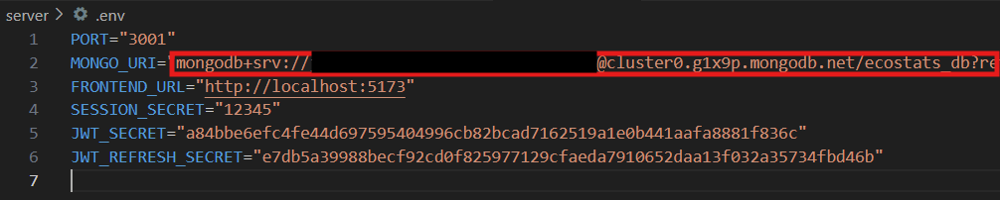
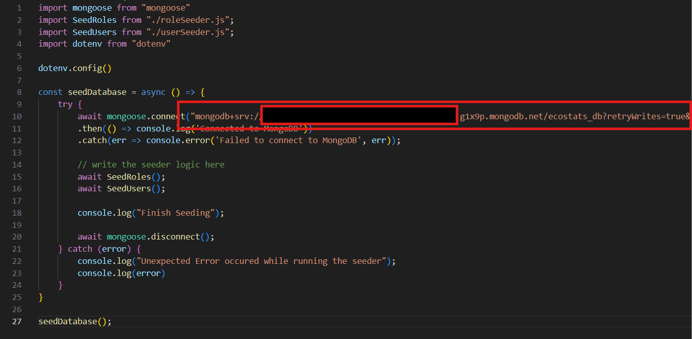

# Ecostats

## Setup

Before anything else make sure to install the following dependencies.

- Node Js, v22.9.0 is better.
- Any code editor eg. VS Code.
- Git.

To get started please clone or download this repository.

### Client

The client is build with react and typescript and scaffold using vite.

#### Installing Client Locally

    1. Open your powershell or windows terminal and navigate to the repository's client folder.
    2. Run `npm i` to install necessary dependencies.

#### Running Client Locally

To run thte client locally make sure that all necessary dependencies are installed.

    1. Open your powershell or windows terminal and navigate to the repository's client folder.
    2. Run `npm run dev` to run the client. It should run on localhost:5173.
    3. Open your browser and visit localhost:5173 url and your app should properly load.

### Server

The server is build with js and users mongodb as database.

#### Installing Server Locally

    1. Open your powershell or windows terminal and navigate to the repository's server folder.
    2. Run `npm i` to install necessary dependencies.
    3. Update the MONGO_URI from the servers .env file and seeder.js file
    
    
    4. Run `node src\seeder\seed.js` to populate your mongodb database. By default all users that are generated have "password" as password.

#### Running Server Locally

To run thte server locally make sure that all necessary dependencies are installed.

    1. Open your powershell or windows terminal and navigate to the repository's client folder.
    2. Run `npm start` to run the client. It should run on localhost:5173.
    3. Open your browser and visit localhost:5173 url and your app should properly load.